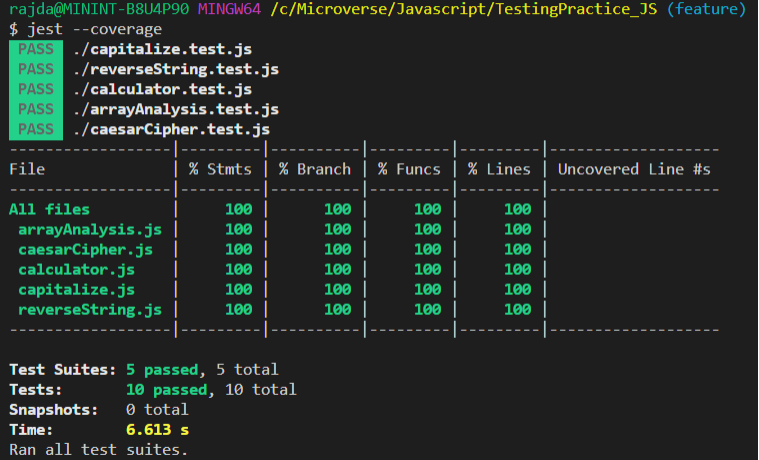
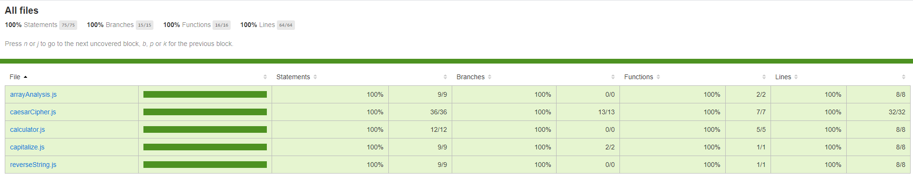

# Testing Practise using Jest

> Using Jest to test different code blocks.

In this project, I have used jest to check the coverage and testing different functions. This project is just about to get hold of testing concept in JS.

## Built With

- JavaScript
- Jest

### Setup

- Fork the repo to your remote repository.
- Clone or download the repository to your local machine.

### Install

- Ensure that you have node.js and npm installed in your machine.
- Run npm install to install the project packages

### Run tests

- Run npm run test to run the test.

## Authors

👤 **Rajkumar Das**

- Github: [@rajkumardas2701](https://github.com/rajkumardas2701)
- Twitter: [@Rajkuma58621299](https://twitter.com/Rajkuma58621299)
- Linkedin: [Rajkumar Das](https://www.linkedin.com/in/rajkumar-das-41308961/)

## 🤝 Contributing

Contributions, issues and feature requests are welcome!

Feel free to check the [issues page](https://github.com/rajkumardas2701/TestingPractice_JS/issues).

## Show your support

Give a ⭐️ if you like this project!

## 📝 License

This project is [MIT](lic.url) licensed.
